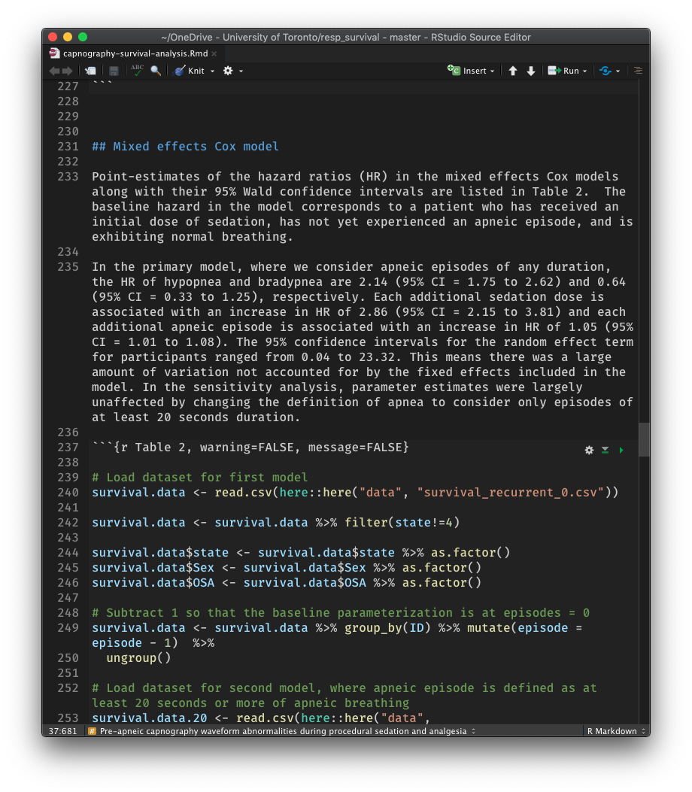
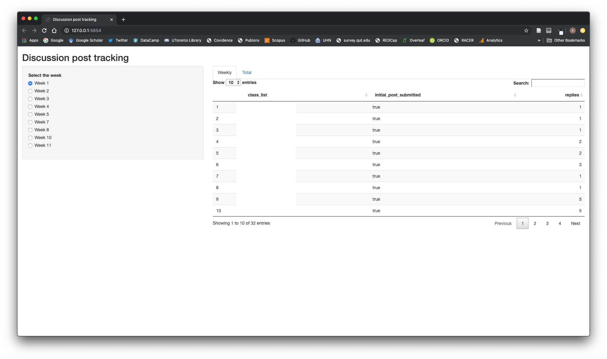
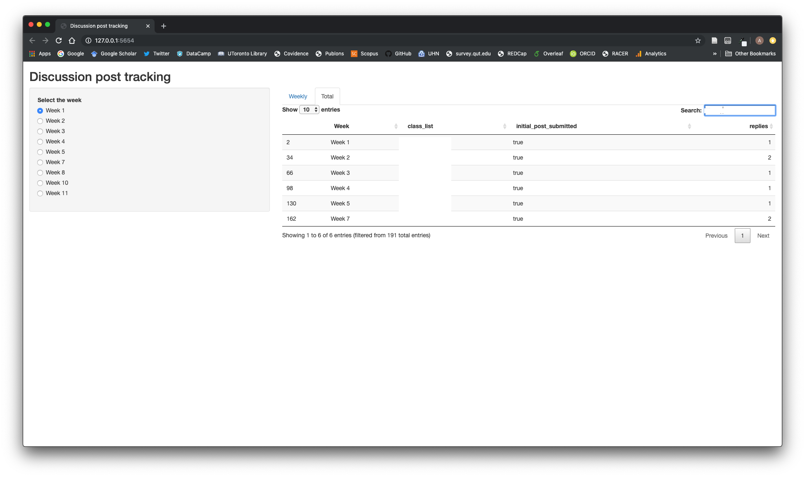

---
output:
  xaringan::moon_reader:
    lib_dir: libs
    css: xaringan-themer.css
    seal: false
    nature:
      highlightStyle: github
      highlightLines: true
      ratio: 16:9
    includes:
      in_header: fa.html
---

class: center top hide-count

## How <strong>you</strong> can help solve the reproducibility crisis
 

### Aaron Conway
### <i class="fab fa-github-square"></i> [Code](http://github.com/awconway/bloomberg-rounds) <i class="fad fa-link"></i> [bloomberg-rounds.netlify.com](https://bloomberg-rounds.netlify.com) <i class="fab fa-twitter-square"></i> [aw_conway](https://twitter.com/aw_conway)
---

class: left middle hide-count

##<i class="fad fa-exclamation-triangle"></i> The reproducibility problem

##<i class="fad fa-toolbox"></i> How to make your analysis reproducible

##<i class="fad fa-grin-stars"></i> Added benefits from using R

---

class: center middle hide-count inverse

# The problem

---
class: center middle hide-count

## Even the most well-meaning of us can make careless errors that undermine the reproducibility and *credibility* of science

---
class: center middle hide-count

background-image: url(http://www.nature.com/polopoly_fs/7.36716.1469695923!/image/reproducibility-graphic-online1.jpeg_gen/derivatives/landscape_630/reproducibility-graphic-online1.jpeg)

background-size: contain

---

class: center, middle, hide-count

background-image: url(http://www.nature.com/polopoly_fs/7.36719.1464174488!/image/reproducibility-graphic-online4.jpg_gen/derivatives/landscape_630/reproducibility-graphic-online4.jpg)

background-size: contain

background-position: left

.pull-right[
## Why reproducibility is so hard
]

---
class: center middle hide-count

<iframe width="600" height="400" src="https://www.youtube.com/embed/66oNv_DJuPc" frameborder="0" allowfullscreen></iframe>

---
class: center, middle, hide-count
<h2>

<blockquote>Reproducibility has the potential to serve as a <strong>minimum standard</strong> for judging scientific claims when full independent replication of a study is not possible.
<blockquote>

</h2>

Source: https://annakrystalli.me/talks/assets/repro-spectrum.jpg

???
## Data shared in accessible format
## Public funding 
## Journals may one day (soon) *require* that data *and* code are made available
## *Biostatistics* 'badges' articles with an R if the associate editor can reproduce the results reported in the paper with the data and code submitted along with the manuscript.

---
class: center middle hide-count

## More people would share their data and code if it was easy for them to do so

---

class: center middle hide-count inverse

# How to make your analysis reproducible

---

class: left middle hide-count

background-image: url(img/map.png)

background-size: contain
background-position: left

.right-pic[
### Result considered 'reproducible' if I can follow the 'analytical map' and calculate the same result that was reported in the paper
]

---
class: left middle hide-count

### <i class="fad fa-map-marked-alt"></i> Use a software program that makes it <u>**easy**</u> to share your analytical 'map' (i.e. the steps used to move from the raw data to the published result)
### <i class="fad fa-share"></i> Share the map (i.e. the code *and* data) with your paper

---
class: center, middle, hide-count, inverse

# Making the map

---

class: left, middle, hide-count
<h3>
>Statistical analysis software that use scripts stored in text files make repeating an exact series of steps significantly easier than those with a graphical user interface where steps must be documented by describing the various menus to click and values to be entered in different windows. 
</h3>
Source: <a href="https://currentprotocols.onlinelibrary.wiley.com/doi/full/10.1002/cpet.32">Open and Reproducible Research on Open Science Framework</a>

---
class: left, middle, hide-count

.pull-left[

]

.pull-right[

]

<i class="fad fa-link"></i><a href="https://aconway.dev/rstudio">Example</>

---
class: center, middle, hide-count, inverse

# Sharing the map

---
class: middle, center, hide-count

# Reproducible software environment

---
class: center, middle, hide-count, inverse

#  binder
---
class: left, top, hide-count

<iframe src="https://www.aaronconway.info/web/viewer.html?file=%2Fpdf/sequence.pdf" height="100%" width="100%" style="border: none;"></iframe>

---
class: left, middle, hide-count

##<i class="fad fa-check-circle"></i>  Can find out with a single click if results can be 'reproduced'

## <i class="fab fa-github-square"></i> Need to know how to use git (version control)

##<i class="fad fa-flushed"></i> Need to know how to navigate RStudio to 'reproduce' the analysis

---
class: center, middle, hide-count, inverse

#<i class="fad fa-link"></i> Nextjournal

---
class: left, top, hide-count

<iframe src="https://www.aaronconway.info/web/viewer.html?file=%2Fpdf/resp-survival.pdf" height="100%" width="100%" style="border: none;"></iframe>

---
class: left, middle, hide-count

##<i class="fad fa-check-circle"></i> Determine 'reproducibility' with a single click

##<i class="fad fa-wifi-2"></i> Can do all of your analyses in the notebook

##<i class="fad fa-users"></i> Collaborate with your team online

---
class: center, middle, hide-count, inverse

# Clarification about data sharing

---
class: left, middle, hide-count

## The data sharing I have talked about is in regard to reproducibility - not data sharing for secondary use

---
class: center middle hide-count inverse

# Added benefits from using R

---

class: left middle hide-count

### <i class="fad fa-angle-double-right"></i> Interactive visualisations

### <i class="fad fa-angle-double-right"></i>Tracking study progress with dashboards

### <i class="fad fa-angle-double-right"></i>Uploading content from a protocol directly to clinicaltrials.gov

### <i class="fad fa-angle-double-right"></i>Interactive exercises for teaching in NUR1027

### <i class="fad fa-angle-double-right"></i>Track discussion board posts in Quercus

---
class: center middle hide-count inverse

# Interactive visualisations

---

class: center middle hide-count

### <i class="fad fa-link"></i> [Zero heat flux systematic review](https://aconway.dev/zhf)

### <i class="fad fa-link"></i> [Pre-apneic capnography waveform abnormalities](https://aconway.dev/pre-apneic)

### <i class="fad fa-link"></i> [Individualized output from cost-effectiveness analyses](https://sedationapps.shinyapps.io/thermalbundleCEA)

---
class: center middle hide-count inverse

# Uploading protocol direct to clinicaltrials.gov

---

class: center top hide-count

## A workflow to enable direct upload of a clinical trial protocol to clinicaltrials.gov
 

### Aaron Conway
### <i class="fab fa-github-square"></i> [Code](http://github.com/awconway/spiritR) <i class="fad fa-link"></i> [spiritR.netlify.com](https://spiritR.netlify.com) <i class="fab fa-twitter-square"></i> [aw_conway](https://twitter.com/aw_conway)

---
class: center, bottom hide-count

background-image: url(img/overview_workflow.png)
background-size: contain

### <i class="fad fa-link"></i> [HFNO protocol](https://www.aaronconway.info/HFNO/Protocol.html)

---

class: center middle hide-count inverse

# Tracking study progress

---

class: center middle hide-count

## Automate the steps of **accessing** and **processing** data that is getting continually updated

## A great use case for this is to assist with tracking screening and recruitment progress

### <i class="fad fa-link"></i> <a href="https://aconway.dev/hfno">HFNO Dashboard</a>

---

class: center middle hide-count inverse

# Teaching
---

class: middle center hide-count

### <i class="fad fa-laptop-code"></i> 'Interactive' exercises for students to analyse <u>*real*</u> data

### Assist learning concepts related to measurement and statistics in quantitative research 

 <i class="fad fa-link"></i> <a href="https://nur1027.netlify.com">NUR1027</a>

---

class: top center hide-count

### Using the Quercus API to track discussion board activity

---

class: top center hide-count

### Using the Quercus API to track discussion board activity

---

class: middle center hide-count

# Demonstration

<i class="fad fa-link"></i> <a href="https://q.utoronto.ca">Quercus</a>

<i class="fad fa-link"></i> <a href="https://aconway.dev/rstudio/">RStudio</a>

---

---
class: center, middle, hide-count, inverse

# Take-away messages

---
class: center, middle, hide-count

### Learning to use tools that make it easy to provide evidence that your results are reproducible is a good idea

### Even if you have not been trained in this approach, it is a good idea to support whoever does your analyses to use these tools

### Time invested in learning to use R will pay off in ways that you may not appreciate until later

---
class: center middle, hide-count, inverse

# Thank you